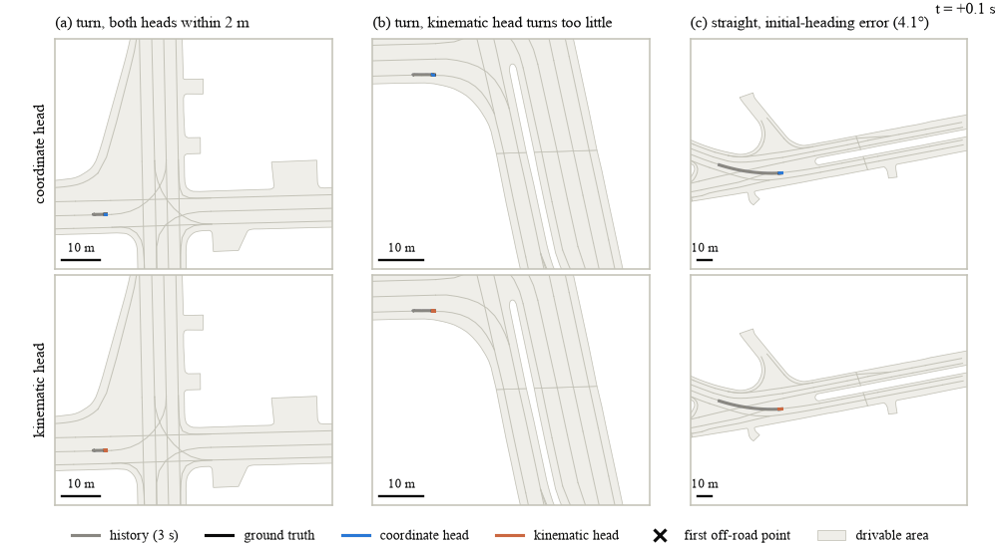

# Physics-Constrained Transformer for Motion Forecasting

**Author:** Ali Taheri · **Report:** [report/report.pdf](report/report.pdf) ·
**Weights:** [v1.0 release](https://github.com/tali7965/Physics-Constrained-Transformer-for-Motion-Forecasting/releases/tag/v1.0) · **License:** [MIT](LICENSE) (code)

Vehicle trajectory forecasting on [Argoverse 2](https://www.argoverse.org/av2.html). Instead of
regressing raw `(x, y)` coordinates, the model predicts **control inputs** (acceleration, curvature)
that are integrated through a **differentiable kinematic bicycle model**, so every predicted
trajectory is kinematically drivable by construction.

The central experiment compares this physics-constrained decoder against an unconstrained coordinate
decoder on accuracy, trajectory feasibility, and data efficiency.



*Three dev scenes, each drawn at random from those that meet its condition: (a) a turn both heads
get right, (b) a turn the physics head under-turns, leaving the road, and (c) a straight road where it
keeps a 4.1° error in its starting heading. Top row: coordinate head; bottom row: physics head. Thick
lines are the most probable modes, and × marks the first off-road point.*

## Results at a glance

On the Argoverse 2 validation split (24,988 scenarios). Both models share one 1.43M-parameter
Transformer encoder, training protocol and selection rule; only the output head differs. Infeasible
and off-road are for the most probable mode of vehicle-like agents (23,113).

| Head | brier-minFDE | minFDE, K=6 | MR, K=6 | minFDE, K=1 | Infeasible, 10 Hz / 2 Hz | Off-road |
| --- | --- | --- | --- | --- | --- | --- |
| Coordinate: 60 positions | **2.57** | **1.94** | **0.303** | **6.09** | 57.8% / 0.00% | **1.5%** |
| Physics: bounded controls, bicycle model | 3.16 | 2.55 | 0.431 | 6.95 | **0.00% / 0.00%** | 5.2% |
| Ground truth | | | | | 2.93% / 0.41% | 0.19% |

- **Accuracy:** the physics head is behind in every setting tested by 0.41–0.73 m brier-minFDE,
  about 40 times the seed-to-seed spread. The settings are two seeds; 10%, 25% and 100% of the
  training subset; with and without the map; and K = 1, 3 and 6.
- **Feasibility:** the coordinate head's infeasibility is step-to-step jitter. Resampled to 2 Hz,
  its paths are as feasible as the ground truth's. The physics head is feasible by construction, but
  it leaves the drivable area more than three times as often.
- **Data efficiency:** the physical prior does not help more with less data: the gap at 10% of the
  training subset is about the same as at 100%.
- **Why:** integration gives the first second's controls about 60 times the gradient of the last
  second's. The off-road excess comes from errors across the lane: a starting heading the head does
  not correct, and turns it does not complete.

Every number has its reproduction command in the development log below. The
[report](report/report.pdf) gives the method and analysis in five pages.

## Setup

Requires Python 3.12: `av2` publishes macOS arm64 wheels for CPython 3.9–3.12 only, so Homebrew's
3.13/3.14 will not work.

```bash
brew install python@3.12
python3.12 -m venv .venv
source .venv/bin/activate
pip install -r requirements.txt
```

## Layout

```text
configs/preprocess.yaml   data paths and preprocessing parameters
configs/lstm.yaml         train/dev protocol and LSTM baseline hyperparameters
configs/transformer.yaml  the same protocol, Transformer hyperparameters
configs/physics.yaml      the Transformer with the physics head
configs/phase5/           Phase 5 runs: seeds, data fractions, no-map and K ablations, step-0 tests
src/config.py             config loading, data_root resolution
src/download.py           fetch scenarios from the public Argoverse S3 bucket
src/explore.py            measure and report the raw scenario format
src/preprocess.py         raw scenarios -> agent-centric tensors
src/visualize.py          scene plots, frame-transform validation, predicted-mode plots
src/data.py               train/dev row selection, in-memory loading of focal or full-scene data
src/metrics.py            minADE, minFDE, miss rate, brier-minFDE (Argoverse 2 definitions), feasibility
src/models.py             constant-velocity baseline, LSTM encoder-decoder, Transformer
src/physics.py            differentiable kinematic bicycle model, control fitting to ground truth
src/train.py              training loop (ADE or winner-takes-all loss), dev-set model selection
src/evaluate.py           score a model on val (or dev), incl. off-road, and write outputs/results/
src/diagnose.py           compare the physics and coordinate heads on dev: accuracy gap and off-road causes
src/submit.py             leaderboard submission file for the focal agent, with an end-to-end check on val
src/figures.py            the report's figures, from the results and checkpoints
src/animate.py            the README animation (assets/examples.gif)
report/                   technical report: LaTeX source, figures and the built PDF
assets/                   README media
data/                     raw and preprocessed data (gitignored)
outputs/                  figures and results (gitignored)
```

The dataset does not live in the repo. `data_root` in `configs/preprocess.yaml` points at the
external SSD; override it without editing the config:

```bash
export AV2_DATA_ROOT=/some/other/path
```

## Downloading the data

Argoverse 2 motion forecasting is a public S3 bucket (no account needed). Measured sizes:

| Split | Scenarios | Size |
| --- | --- | --- |
| train | 199,908 | 47.0 GB |
| val | 24,988 | 5.9 GB |
| test | 24,984 | 4.1 GB |

```bash
brew install s5cmd
source .venv/bin/activate

python src/download.py --split val --limit 100      # quick sanity check (~25 MB)
python src/download.py --split val                  # full val, for evaluation
python src/download.py --split test                 # full test, for submission files
python src/download.py --split train                # full train (47 GB): the training subset is drawn from all of it
```

Scenarios land in `<data_root>/raw/<split>/<scenario-id>/`. The script is resumable: re-running
skips anything already complete and verifies every scenario on disk before reporting `OK`. Without
`--limit` a whole split is fetched. The first run for each split lists the bucket and caches the
scenario ids under `<data_root>/raw/manifests/` (train takes a few minutes to list).

## Pretrained weights

The [v1.0 release](https://github.com/tali7965/Physics-Constrained-Transformer-for-Motion-Forecasting/releases/tag/v1.0) holds the two checkpoints behind the table above (5.8 MB
each). They are under the Argoverse 2 terms, for non-commercial use (see License).

```bash
mkdir -p weights
curl -L -o weights/transformer.pt https://github.com/tali7965/Physics-Constrained-Transformer-for-Motion-Forecasting/releases/download/v1.0/transformer.pt
curl -L -o weights/physics.pt https://github.com/tali7965/Physics-Constrained-Transformer-for-Motion-Forecasting/releases/download/v1.0/physics.pt
python src/evaluate.py --checkpoint weights/transformer.pt      # needs the preprocessed val split
python src/visualize.py --split val --random 6 --seed 0 --checkpoint weights/physics.pt
```

## Reproduce

These steps produce every number in this README and in the report. The training subset and the dev
set are drawn from the whole train split, so all of it must be downloaded and preprocessed (47 GB
raw, 16 GB processed).

```bash
python src/download.py --split train                   # and --split val (see Downloading the data)
python src/preprocess.py --split train                 # and --split val
python src/train.py --config configs/transformer.yaml  # coordinate head, 3.1 h on an M4 laptop
python src/train.py --config configs/physics.yaml      # physics head, 3.3 h
python src/evaluate.py --checkpoint outputs/runs/transformer/best.pt
python src/evaluate.py --checkpoint outputs/runs/physics/best.pt
python src/train.py --config configs/phase5/physics-f10.yaml   # each of the 12 ablation configs, ~34 h in all
python src/diagnose.py --physics outputs/runs/physics/best.pt --coordinate outputs/runs/transformer/best.pt
python src/figures.py                                  # report figures
python src/animate.py                                  # README animation
cd report && latexmk -pdf report.tex
```

## License

The code is under the [MIT license](LICENSE). The Argoverse 2 data is © 2021 Argo AI, LLC, licensed
under [CC BY-NC-SA 4.0](https://creativecommons.org/licenses/by-nc-sa/4.0/) for non-commercial use.
The pretrained weights, the figures, the animation and the report's plots are derived from it and
fall under the same terms.

## Development log

The project ran in six phases, each planned once the previous one had closed. The sections below
record what was measured and decided, in order, with the commands that produce each number.

### Status

Phase 1 (Setup & Data) — complete: all three splits are preprocessed and visually checked.
Phase 2 (Baselines) — complete: metrics, constant-velocity and LSTM baselines (see Results).
Phase 3 (Transformer model) — complete: a 1.4M-parameter Transformer with a K=6 coordinate decoder
beats the LSTM on every metric (see Results).
Phase 4 (physics-constrained decoder) — complete: it trains stably and every predicted trajectory is
feasible, at a cost in accuracy that Phase 5 has to explain (see Results).
Phase 5 (experiments) — complete: seeds, data efficiency, map and K ablations, and a diagnosis of
the off-road excess. The physics head stays behind by 0.4–0.7 m brier-minFDE in every setting. The
leaderboard entry was dropped because the challenge had closed, so results are on val (see Results).
Phase 6 (analysis and write-up) — complete: the technical report, its figures, the README animation
and front page, and the pretrained weights (v1.0 release).

### Data

Measured over the full validation split (24,988 scenarios) with `python src/explore.py --split val`;
the complete report is written to `outputs/explore_val.txt`.

**Timeline** — every scenario has 110 timesteps at 0.1 s (10 Hz): 50 observed (5 s history) and
60 future (6 s horizon). No exceptions in the split.

**Agents** — 2–255 tracks per scenario (median 52). Object types over all tracks: 73.5% VEHICLE,
9.5% PEDESTRIAN, 7.0% STATIC, 4.8% BACKGROUND, then CONSTRUCTION, RIDERLESS_BICYCLE, BUS, CYCLIST,
MOTORCYCLIST, UNKNOWN (each < 2%). Track categories: 81.1% TRACK_FRAGMENT, 11.9% UNSCORED_TRACK,
5.2% SCORED_TRACK, 1.8% FOCAL_TRACK (one per scenario). Every FOCAL, SCORED and UNSCORED track
spans all 110 steps; every TRACK_FRAGMENT is partial.

**Focal track** — 88.6% VEHICLE, 6.3% PEDESTRIAN, 3.4% BUS, 1.2% CYCLIST, 0.5% MOTORCYCLIST.
Speed over all focal timesteps: p50 5.95 m/s, p95 14.86 m/s, max 29.56 m/s (p5 is 0 — stationary
agents are common).

**Map** — 2–281 lane segments per scenario (median 62); 87.7% VEHICLE, 11.4% BIKE, 0.9% BUS lanes;
34% of segments are in an intersection. Raw lane boundaries have 2–59 points (median 3); the
`av2` API returns a fixed 10-point centerline per segment. Median 4 pedestrian crossings and 3
drivable-area polygons per scenario.

**Cities** — miami 26.6%, pittsburgh 21.3%, austin 21.3%, washington-dc 12.8%, dearborn 12.3%,
palo-alto 5.7%.

**Load cost** — 18 ms per scenario (parquet + map JSON), ~9 min wall time for the whole val split.

### Preprocessing

```bash
python src/preprocess.py --split val --limit 200 --workers 1   # quick check
python src/preprocess.py --split val                           # whole split, 8 workers
python src/preprocess.py --split test
python src/preprocess.py --split train
python src/visualize.py --split val --random 6 --seed 0        # figures + round-trip check
```

Each scenario becomes fixed-shape arrays in a frame centred on the focal agent at the last observed
step (t=49), with the x-axis along its recorded heading. The recorded heading is within 4° of the
velocity direction for 99% of moving focal agents, so it is a safe axis.

**Region and caps** — agents present at t=49 and lane segments with any centerline point within
150 m of the focal agent, nearest first, up to 64 agents (focal in slot 0) and 192 lanes. 150 m
covers the farthest focal future measured (149 m). The caps sit just above the measured p99; the
numbers behind them are in `configs/preprocess.yaml`. A scene over a cap loses its farthest
elements, and `meta.json` counts how often that happens:

| Split | Scenarios | On disk | Over agent cap | Over lane cap | Time, 8 workers |
| --- | --- | --- | --- | --- | --- |
| train | 199,908 | 15.72 GB | 0.69% | 0.16% | 23 min |
| val | 24,988 | 1.96 GB | 0.68% | 0.15% | 2 min |
| test | 24,984 | 1.94 GB | 0.62% | 0.18% | 2 min |

**Layout** — `<data_root>/processed/<split>/`, one `.npy` per field, row *i* = *i*-th scenario of
the split manifest. Load with `np.load(path, mmap_mode="r")`.

| File | Shape | dtype | Content |
| --- | --- | --- | --- |
| `agents.npy` | [N, 64, 50, 5] | float32 | history x, y, vx, vy, heading; zeros where invalid |
| `agent_valid.npy` | [N, 64, 50] | bool | step observed |
| `agent_type.npy` | [N, 64] | int8 | index into `object_types` in `meta.json`; -1 = empty slot |
| `lanes.npy` | [N, 192, 10, 2] | float32 | 10-point centerline from the `av2` map API |
| `lane_type.npy` | [N, 192] | int8 | index into `lane_types`; -1 = empty slot |
| `lane_intersection.npy` | [N, 192] | bool | segment lies in an intersection |
| `target.npy` | [N, 60, 5] | float32 | focal future, same features (train and val only) |
| `origin.npy`, `theta.npy` | [N, 2], [N] | float64 | frame origin and heading in city coordinates |
| `scenario_id.npy`, `city.npy` | [N] | str | |
| `meta.json` | | | parameters, type vocabularies, truncation counts, git commit |

Every focal type is kept (`agent_type[:, 0]`). Vehicle-only selection and training subsets are
index choices at training time, and the test split keeps every focal agent for the leaderboard.

**Checks** — every scenario asserts that the focal agent sits at the origin with zero heading, that
kept agents are present at t=49, that all values are finite, and that train/val have 60 future
steps. `src/visualize.py` maps processed rows back to city coordinates and compares them with the
raw scenario; the largest position error seen is under 1e-5 m (float32 precision). Two full val
runs, and two full test runs, produced bit-identical files; re-processing 20 random rows per split
matches the stored arrays exactly. 143 test parquets store `timestep` as float64 instead of int64;
the preprocessing casts it and asserts nothing is lost.

### Results

**Protocol** — a seeded permutation of the train split gives a fixed *dev* set of 5,000 scenarios,
used only for model selection, and a fixed *training subset* of 50,000 scenarios. The 10% and 25%
subsets for the data-efficiency study are prefixes of it, so they are nested. The official val split
(24,988 scenarios) is used only for the numbers reported here. All settings live in
`configs/lstm.yaml`.

**Metrics** — the Argoverse 2 definitions: of the K most probable modes, the best is the one with the
lowest endpoint error; minADE and minFDE are its average and final errors; a miss is a minFDE over
2 m; brier-minFDE adds (1 − p_best)² and ranks the leaderboard at K=6. `src/metrics.py` matches the
`av2` package's per-scenario functions exactly.

**Baselines on val, K=1** (both baselines predict a single trajectory):

| Model | Population | minADE | minFDE | MR |
| --- | --- | --- | --- | --- |
| Constant velocity, tracker velocity | all focal (24,988) | 4.70 | 12.15 | 0.863 |
| Constant velocity, last-step displacement | all focal | 4.40 | 11.66 | 0.855 |
| LSTM encoder–decoder | all focal | **3.15** | **8.33** | **0.821** |
| Constant velocity, tracker velocity | vehicle-like (23,113) | 5.00 | 12.96 | 0.905 |
| Constant velocity, last-step displacement | vehicle-like | 4.69 | 12.43 | 0.899 |
| LSTM encoder–decoder | vehicle-like | **3.31** | **8.78** | **0.856** |

Vehicle-like means VEHICLE, BUS and MOTORCYCLIST focal agents, the population the Argoverse 2 paper
uses for its baselines. Its focal-history-only LSTM (Table 5, beta dataset) reports 3.05 / 8.28 /
0.85, close to ours. The LSTM (270k parameters) uses only the focal agent's history: a 2-layer
encoder and an autoregressive decoder over 60 steps, trained with an ADE loss for 30 epochs, about
5 minutes on the M4 GPU. Training and dev error end almost equal (3.12 vs 3.15 m), so it underfits
rather than overfits.

```bash
python src/evaluate.py --model cv-tracker
python src/evaluate.py --model cv-displacement
python src/train.py --config configs/lstm.yaml
python src/evaluate.py --checkpoint outputs/runs/lstm/best.pt
```

#### Transformer

**Model** — every agent (its 50 history steps) and every lane (the 9 segments of its centerline) is
encoded PointNet-style into one token: a shared MLP per step or segment, max-pooled, plus type
embeddings; a learned timestep embedding keeps the order of history steps. A 4-layer Transformer
encoder runs joint self-attention over all 64 agent and 192 lane tokens, so agent–agent and
agent–map attention share the same layers; empty slots are masked, and there is no slot positional
encoding, so outputs do not depend on slot order (checked: shuffling slots changes outputs by
3e-14 m in float64). Six mode queries — the focal token plus a learned mode embedding — attend to
the scene in a 2-layer Transformer decoder; an MLP maps each mode to 60 future positions and a
linear layer to a logit. d=128, 8 heads, 1.43M parameters. The trajectory MLP is the part the
Phase 4 physics head replaces.

**Training** — winner-takes-all: the mode with the lowest endpoint error (the metric's rule) gets the
ADE loss, and the logits get a cross-entropy loss towards that mode. Adam, cosine decay, gradient
clipping 1.0, batch 64, 30 epochs, all focal types, same training subset and dev set as the LSTM.
`best.pt` is the epoch with the lowest dev brier-minFDE at K=6. The full run takes 3.1 h on the M4
GPU (116 scenes/s; the 50k scenes, 4.3 GB, are held in RAM).

Mode embeddings must start at the scale of the tokens they are added to: initialised at std 0.02
next to a layer-normed focal token, all six queries were nearly identical and the modes collapsed
(endpoints 0.6 m apart, probabilities stuck at 1/6). At std 1 the modes separate.

**Learning rate** — chosen on the 10% subset (5,000 scenes, 30 epochs), by dev brier-minFDE:

| lr | dev brier-minFDE | dev minFDE, K=6 | dev minADE / minFDE, K=1 |
| --- | --- | --- | --- |
| 3e-4 | 4.18 | 3.59 | 3.63 / 9.00 |
| **1e-3** | **3.95** | **3.29** | **3.51 / 8.75** |
| 3e-3 | 6.04 | 5.39 | 4.38 / 11.25 |

**Results on val** (K=1 uses the most probable mode):

| Model | Population | K | minADE | minFDE | MR | brier-minFDE |
| --- | --- | --- | --- | --- | --- | --- |
| LSTM encoder–decoder | all focal | 1 | 3.15 | 8.33 | 0.821 | |
| Transformer | all focal | 1 | **2.45** | **6.09** | **0.709** | |
| Transformer | all focal | 6 | 1.06 | 1.94 | 0.303 | 2.57 |
| LSTM encoder–decoder | vehicle-like | 1 | 3.31 | 8.78 | 0.856 | |
| Transformer | vehicle-like | 1 | **2.56** | **6.40** | **0.740** | |
| Transformer | vehicle-like | 6 | 1.10 | 2.01 | 0.317 | 2.64 |

The Transformer beats the LSTM at K=1 by 22% on minADE and 27% on minFDE (all focal). Its weak
point is mode scoring: the classification loss ends at 1.64 against 1.79 for uniform guessing, and
the most probable mode is often not the closest one (K=1 minFDE 6.09 vs 1.94 at K=6). Dev metrics
were still improving slightly at epoch 30. In the mode plots some low-probability modes wobble or
leave the lanes, which is what the kinematic decoder of Phase 4 is meant to rule out.

```bash
python src/train.py --config configs/transformer.yaml
python src/evaluate.py --checkpoint outputs/runs/transformer/best.pt
python src/visualize.py --split train --random 6 --seed 0 --checkpoint outputs/runs/transformer/best.pt
```

#### Physics-constrained decoder

**Model** — the Transformer above with only `traj_head` changed: per mode it outputs 60 pairs of
controls instead of 60 positions, bounded with `tanh` to an acceleration in ±8 m/s² and a steering
fraction in ±1. `src/physics.py` integrates them through a kinematic bicycle model in curvature form
from the focal agent's state at t=49 (position; heading and speed from the last-step displacement,
the recorded heading below 0.5 m/s). Curvature is the steering fraction times
min(0.2 1/m, 6 m/s² / v²), a 5 m turning radius at low speed and at most 6 m/s² of lateral
acceleration above it; speed cannot go negative. Every mode is therefore drivable by construction.
The parameter count (1.43M), losses, protocol and all other settings are unchanged, and the head is
used for every focal type, pedestrians included. Fitting controls directly to ground-truth futures
(`python src/physics.py --check`, 2,000 vehicle-like training scenes) puts the head's error floor at
0.16 m FDE on average, with 0.55% of futures more than 2 m away.

**Feasibility metrics** — for vehicle-like agents, a trajectory is *infeasible* if its lateral
acceleration (speed × yaw rate) exceeds 8 m/s² at any step while moving faster than 1 m/s. It is
measured at 10 Hz, where ±4 cm of step-to-step zigzag already crosses the limit, and on the
trajectory resampled to 2 Hz, which judges the manoeuvre's shape. A trajectory is *off-road* if any
point lies outside every drivable-area polygon of the scenario's map. Both are reported for the most
probable mode (@1), over all six modes (@6), and for the ground truth.

**Learning rate** — chosen on the 10% subset as for the coordinate head (best coordinate head there:
3.95):

| lr | dev brier-minFDE | dev minFDE, K=6 | dev minADE / minFDE, K=1 |
| --- | --- | --- | --- |
| 1e-4 | 4.39 | 3.75 | 3.53 / 9.29 |
| **3e-4** | **4.19** | **3.53** | 3.94 / 10.29 |
| 1e-3 | 5.81 | 5.20 | 4.20 / 10.69 |

**Results on val** (K=1 uses the most probable mode):

| Model | Population | K | minADE | minFDE | MR | brier-minFDE |
| --- | --- | --- | --- | --- | --- | --- |
| Transformer, coordinate head | all focal | 1 | **2.45** | **6.09** | **0.709** | |
| Transformer, physics head | all focal | 1 | 2.74 | 6.95 | 0.755 | |
| Transformer, coordinate head | all focal | 6 | **1.06** | **1.94** | **0.303** | **2.57** |
| Transformer, physics head | all focal | 6 | 1.25 | 2.55 | 0.431 | 3.16 |
| Transformer, coordinate head | vehicle-like | 1 | **2.56** | **6.40** | **0.740** | |
| Transformer, physics head | vehicle-like | 1 | 2.89 | 7.35 | 0.791 | |
| Transformer, coordinate head | vehicle-like | 6 | **1.10** | **2.01** | **0.317** | **2.64** |
| Transformer, physics head | vehicle-like | 6 | 1.31 | 2.67 | 0.457 | 3.28 |

**Physical plausibility on val**, vehicle-like agents (23,113), share of trajectories:

| | Infeasible, 10 Hz | Infeasible, 2 Hz | Off-road |
| --- | --- | --- | --- |
| Ground truth | 2.93% | 0.41% | 0.19% |
| Coordinate head @1 / @6 | 57.8% / 70.0% | 0.00% / 0.01% | **1.52% / 1.75%** |
| Physics head @1 / @6 | **0.00% / 0.00%** | 0.00% / 0.00% | 5.17% / 5.68% |

The physics head meets the Phase 4 milestone. It trains stably, and none of its trajectories are
infeasible at either resolution. In the six dev mode plots its paths are smooth and follow the lane direction.

It does not yet pay for itself, though. On val it is behind the coordinate head on every accuracy
metric: brier-minFDE is 3.16 against 2.57, and K=1 minFDE is 6.95 against 6.09. It still beats the
LSTM at K=1 (2.74 / 6.95 against 3.15 / 8.33). The gap on dev grew from 0.24 m on the 10% subset to
0.63 m on the full subset (3.21 against 2.58).

The physics head underfits. Train ADE ends at 1.18 against 1.04, and dev brier-minFDE improves only
slowly after epoch 20 (3.30 at epoch 20, 3.21 at epoch 28). Since the head can reach vehicle-like
ground-truth futures to within 0.16 m, the limit looks like optimisation rather than what the head
can express. That is not yet tested.

The coordinate head's infeasibility is almost entirely step-to-step jitter. At 2 Hz its paths are
already feasible (0.00%, against 0.41% for the ground truth).

The physics head leaves the drivable area more than three times as often (5.2% against 1.5%), and the cause is
not yet known. Its mode scoring is slightly better: the classification loss ends at 1.59 against
1.64.

The full run takes 3.3 h on the M4 GPU, against 3.1 h for the coordinate head.

```bash
python src/physics.py --check --n 2000
python src/train.py --config configs/physics.yaml
python src/evaluate.py --checkpoint outputs/runs/physics/best.pt
python src/visualize.py --split train --random 6 --seed 0 --checkpoint outputs/runs/physics/best.pt
```

#### Physics-head diagnosis

Before the Phase 5 experiments, `src/diagnose.py` compared the two heads' best checkpoints on the dev
rows (val stays for reporting).

**Pedestrians are not the cause.** On val the gap is as large for vehicle-like agents (brier-minFDE
3.28 against 2.64) as for all focal agents (3.16 against 2.57). Off-road is measured for
vehicle-like agents only.

**Late controls get little gradient.** The table shows the mean |gradient| that the training loss
sends to the head's outputs in each 1 s band of the future, relative to the mean over all 60 steps:

| | 0–1 s | 1–2 s | 2–3 s | 3–4 s | 4–5 s | 5–6 s |
| --- | --- | --- | --- | --- | --- | --- |
| Coordinate head, x | 1.00 | 1.01 | 1.03 | 1.02 | 0.98 | 0.96 |
| Physics head, acceleration | 2.47 | 1.96 | 0.98 | 0.44 | 0.11 | 0.04 |
| Physics head, steering | 2.50 | 1.46 | 1.06 | 0.69 | 0.24 | 0.04 |

A control moves every later position, so controls in the first second get about 60 times the
gradient of those in the last.

**The acceleration chatters at its bounds.** 31% of the most probable mode's accelerations are
within 5% of ±8 m/s² (55% in the last 2 s), against 6% of steering values. In the first 4 s the
acceleration changes sign at 57–80% of steps, where a smooth control would rarely change sign at
all. The head builds its speed profile from a saturated zigzag whose 1 s average is close to the
ground truth's (median |a| 0.88 against 0.61 m/s²). Where tanh saturates, almost no gradient passes.

**The gap is spread over speeds and the horizon.** Binned by initial speed, the K=6 minFDE gap is
0.26 m for stationary agents and 0.6–0.8 m at every moving speed (1.2 m above 15 m/s). The off-road
excess also appears at every moving speed (3.4–7.9% against 1.6–1.9%). The initial heading is not
the cause: at every moving speed, the last-step heading the head starts from is closer to the first
ground-truth step than the recorded heading is (median 0.1–0.7° against 0.6–2.8°). The best-mode
error gap grows steadily with the horizon: 0.16 m at 3 s, 0.46 m at 5 s, 0.54 m at 5.4 s and 0.65 m
at 6 s.

**The ground truth slows down in its last 0.7 s.** In the raw scenario parquets too, the focal
agent's positions decelerate sharply at the end of the scenario while its recorded velocity does
not. On the dev rows, the vehicle-like speed computed from position differences falls from
7.7 m/s at future step 53 to 3.6 m/s at step 59, while the recorded speed stays at
about 7.3 m/s. That is an apparent −8.6 m/s² at the last step. The benchmark scores every model
against these positions. A coordinate head can copy the artifact, but the physics head would have to
brake at its bound to follow it, and 55% of its last-second accelerations sit at the bound. The
artifact adds only about 0.1 m to the gap, though: the gap grows at the same rate over the final
0.6 s as before it.

**Controls at 0.5 s knots do not help.** `model.control_step: 5` makes the head output controls at
13 knots, 0.5 s apart, linearly interpolated in between. This rules out step-to-step chatter by
construction, and it raises the vehicle-like FDE fitting floor only from 0.16 m to 0.17 m. Results on
the 10% subset (30 epochs, all runs at the same commit):

| Head | lr | Dev brier-minFDE, seed 0 | Seed 1 | Off-road @1, seed 0 / 1 |
| --- | --- | --- | --- | --- |
| Per-step controls | 3e-4 | **4.28** | **4.13** | **8.6% / 8.0%** |
| Knots every 0.5 s | 3e-4 | 4.41 | 4.21 | 9.3% / 9.7% |
| Knots every 0.5 s | 1e-3 | 5.98 | | 9.6% |

The knots are behind at both seeds. They remove the step-to-step chatter but not the gradient
imbalance, which comes from integration itself. Phase 5 keeps the per-step physics head of Phase 4.

```bash
python src/diagnose.py --physics outputs/runs/physics/best.pt --coordinate outputs/runs/transformer/best.pt
python src/physics.py --check --n 2000 --control-step 5
python src/train.py --config configs/phase5/step0-knots-seed0.yaml
```

#### Phase 5 experiments

Each run changes one setting of the Phase 3 (coordinate head) or Phase 4 (physics head) configuration.
The head keeps its own learning rate (1e-3 and 3e-4), and `best.pt` is selected on dev; the configs
are in `configs/phase5/`. The 100%, seed-0, K=6 rows are the Phase 3 and Phase 4 runs. The 12 new
runs were trained at commit d3c39e0, whose evaluation reproduces the Phase 3 and 4 val numbers
exactly; together they took 34 h on the M4.

All numbers are on val. Each cell reads *coordinate head / physics head*, with the better one in bold.
brier-minFDE and minFDE are over all focal agents, and off-road is for the most probable mode of
vehicle-like agents.

**Seeds** — 100% of the training subset, K=6:

| Seed | brier-minFDE | minFDE, K=6 | minFDE, K=1 | Vehicle-like brier-minFDE | Off-road @1 |
| --- | --- | --- | --- | --- | --- |
| 0 | **2.57** / 3.16 | **1.94** / 2.55 | **6.09** / 6.95 | **2.64** / 3.28 | **1.5%** / 5.2% |
| 1 | **2.56** / 3.18 | **1.93** / 2.57 | **6.10** / 7.09 | **2.63** / 3.30 | **1.6%** / 5.9% |

Between seeds, each head's brier-minFDE moves by at most 0.016. The gap between the heads is 0.59
and 0.62, about 40 times that. The physics head's K=1 minFDE (by 0.14) and its off-road share
(by 0.8 points) vary more between seeds, but the off-road share stays more than three times the
coordinate head's.

**Data efficiency** — 10%, 25% and 100% of the training subset. Every run gets about 23.5k gradient
steps, with dev checked about every 790 steps, so the smaller subsets get more epochs rather than
less training:

| Training scenes | Epochs | brier-minFDE | minFDE, K=6 | minFDE, K=1 | Vehicle-like brier-minFDE | Off-road @1 | `best.pt` epoch |
| --- | --- | --- | --- | --- | --- | --- | --- |
| 5,000 (10%) | 300 | **3.33** / 3.98 | **2.67** / 3.37 | 8.62 / **8.51** | **3.42** / 4.16 | **4.1%** / 8.1% | 130 / 80 |
| 12,500 (25%) | 120 | **2.88** / 3.61 | **2.24** / 3.00 | **6.93** / 8.27 | **2.96** / 3.76 | **2.3%** / 7.9% | 100 / 48 |
| 50,000 (100%) | 30 | **2.57** / 3.16 | **1.94** / 2.55 | **6.09** / 6.95 | **2.64** / 3.28 | **1.5%** / 5.2% | 30 / 28 |

The physical prior does not help more when data is short. The brier-minFDE gap is 0.66 at 10%,
0.73 at 25% and 0.59 at 100% (20–25% of the coordinate head's error), and the physics head trained
on 50,000 scenes (3.16) is behind the coordinate head trained on 12,500 (2.88). The one exception
is the most probable mode at 10%, where the physics head is slightly ahead (K=1 minADE 3.31 against
3.47, minFDE 8.51 against 8.62).

Both heads overfit the smaller subsets, so those val numbers come from early `best.pt` epochs. The
physics head overfits earlier and further. At 10% its dev brier-minFDE rises from 4.02 at epoch 80
to 5.25 at epoch 300, while the coordinate head's rises from 3.39 at epoch 130 to 3.68. Its train
ADE then falls to 0.73 (coordinate head 0.74), far below the 1.18 where the 100% physics run ends.
Given enough passes, it fits its training scenes as closely as the coordinate head. That is
consistent with the Phase 4 reading that it underfits because it optimises slowly, not because it
cannot express the futures.

**Map** — 100%, K=6, with the lane tokens removed so that the encoder sees only the agents:

| Map | brier-minFDE | minFDE, K=6 | minFDE, K=1 | Vehicle-like brier-minFDE | Off-road @1 | Run time |
| --- | --- | --- | --- | --- | --- | --- |
| yes | **2.57** / 3.16 | **1.94** / 2.55 | **6.09** / 6.95 | **2.64** / 3.28 | **1.5%** / 5.2% | 3.1 / 3.3 h |
| no | **3.18** / 3.58 | **2.55** / 2.97 | **7.50** / 7.90 | **3.29** / 3.73 | **4.0%** / 7.1% | 1.1 / 1.2 h |

The map is worth 0.60 brier-minFDE to the coordinate head and 0.42 to the physics head. Without it
the gap shrinks to 0.41 but does not close, so a weaker use of the map explains only part of the
physics head's deficit. Even with the map, the physics head leaves the drivable area more often
(5.2%) than the coordinate head does without one (4.0%). Removing the lane tokens cuts the run time
to about a third.

**Number of modes** — 100%, trained and scored with K = 1, 3 or 6 modes. `best.pt` is selected by
dev minFDE for K=1 and by dev brier-minFDE at the model's own K otherwise:

| K | brier-minFDE@K | minFDE@K | minFDE, K=1 | Vehicle-like brier-minFDE@K | Off-road @1 |
| --- | --- | --- | --- | --- | --- |
| 1 | **5.19** / 5.81 | **5.19** / 5.81 | **5.19** / 5.81 | **5.44** / 6.12 | **2.0%** / 4.6% |
| 3 | **3.17** / 3.72 | **2.77** / 3.33 | **5.92** / 6.49 | **3.28** / 3.88 | **1.6%** / 4.7% |
| 6 | **2.57** / 3.16 | **1.94** / 2.55 | **6.09** / 6.95 | **2.64** / 3.28 | **1.5%** / 5.2% |

The gap is 0.62, 0.54 and 0.59 at K = 1, 3 and 6, so it does not depend on the number of modes. A
model trained with a single mode predicts better than a K=6 model's most probable mode (5.19
against 6.09 for the coordinate head, 5.81 against 6.95 for the physics head). This points again
at mode scoring as the weak spot of the K=6 models.

**Feasibility** — the physics head is 0.00% infeasible at 10 Hz and at 2 Hz in every run. At 2 Hz the
coordinate head is at most 0.01% infeasible in every run, against 0.41% for the ground truth. At
10 Hz its most probable mode is infeasible for 55–61% of trajectories at 100% of the data, 70% at
25% and 97% at 10%, so its step-to-step jitter grows as the training set shrinks.

**Why the physics head leaves the road** — `src/diagnose.py` on the dev rows, for the most probable
mode of the 4,636 vehicle-like agents. Off-road there is 5.2% for the physics head, 1.6% for the
coordinate head and 0.2% for the ground truth.

- *Not the control chatter.* Re-rolling the physics head's own controls after a 1 s moving average
  gives 5.0% off-road, and removing its steering in the last second gives 5.5%.
- *Mostly in turns.* Futures whose heading changes by 10° or more (first against last 1 s chord) are
  19% of the scenes but 62% of the physics head's off-road modes. There it leaves the road 15–18%
  of the time, against 5–7% for the coordinate head. Its most probable mode turns less (median 0.85
  of the ground truth's heading change, against 0.92), and 61% of its off-road modes in turns end on
  the outside of the turn (coordinate head 55%). The bounds allow the turn, though: its best mode
  turns as far as the coordinate head's (0.92 against 0.94). In the turns where it leaves the road,
  its steering is at the bound in 18% of steps, against 15% in turns where it stays on.
- *On straight roads, it keeps its starting heading.* Step 0 showed that the last-step direction is
  the better of the two starting headings. But over the first second, the physics head's most
  probable mode keeps 94% of that direction's error against the ground truth's first-second
  direction, while the coordinate head keeps 3%. For straight futures, the physics head's off-road
  share rises with that error from 1.2% (below 1°) to 18.4% (4° or more), against 0.2% to 2.4%.
- *Its sideways misses leave the road more often.* When the most probable mode's endpoint is more
  than 2 m to the side of the ground truth's, the physics head is off-road 2–3 times as often as the
  coordinate head with the same miss: 10.6% against 5.5% at 2–4 m, and 28.3% against 9.2% beyond
  4 m. It also misses by that much more often (1,007 scenes against 657). Below 1 m, it is not worse
  (0.3% for both below 0.5 m).

The off-road excess comes from errors that run across the lane rather than along it: a starting
heading the head does not correct, or a turn it does not complete.

**Research questions** — what these runs answer:

1. *Accuracy.* The physics-constrained decoder does not match the coordinate decoder. Its
   brier-minFDE is behind in every setting, by 0.41–0.73, far more than the seed spread. The only
   metrics it wins are those of the most probable mode at 10% of the data.
2. *Feasibility.* The coordinate head's trajectories are infeasible only at 10 Hz, from
   step-to-step jitter. At 2 Hz they are as feasible as the physics head's. The physics head
   removes the jitter, but it leaves the drivable area 1.8–3.7 times as often.
3. *Data efficiency.* The physical prior does not help more with less data: the gap is about the
   same at 10%, 25% and 100% of the training subset.

**Leaderboard** — the single-agent phase of the Argoverse 2 challenge on EvalAI (challenge 1719)
stopped accepting submissions on 2025-10-31, so no test results are reported. `src/submit.py` still
writes a valid submission file. Read back through av2's `ChallengeSubmission` and scored with av2's
own metrics on 2,000 val scenarios, it matches `src/metrics.py` to within 1e-8 m.

```bash
python src/train.py --config configs/phase5/physics-f10.yaml        # one config per run in configs/phase5/
python src/evaluate.py --checkpoint outputs/runs/physics-f10/best.pt
python src/diagnose.py --physics outputs/runs/physics/best.pt --coordinate outputs/runs/transformer/best.pt
python src/visualize.py --split train --random 6 --seed 0 --checkpoint outputs/runs/physics-k1/best.pt
python src/submit.py --checkpoint outputs/runs/transformer/best.pt --split val --limit 2000   # pipeline check
python src/submit.py --checkpoint outputs/runs/transformer/best.pt --split test
```

### Report

The report in `report/` uses the IEEE conference template. Its numbers come from the val results and
the dev diagnosis above, and `src/figures.py` regenerates every figure. It needs the best checkpoints
of the `transformer` and `physics` runs, their val results, and the SSD for the dev scenes and maps.

```bash
python src/figures.py                                    # report/figures/*.pdf
cd report && latexmk -pdf report.tex                     # report/report.pdf (TeX Live)
```
