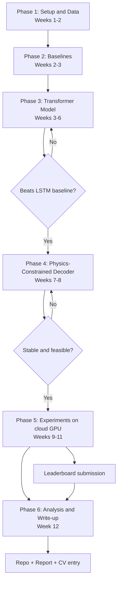

# Physics-Constrained Transformer for Motion Forecasting

**Author:** Ali Taheri
**Duration:** ~12 weeks (part-time)
**Hardware:** MacBook Air M4, 16 GB (PyTorch MPS) + free cloud GPU (Kaggle / Colab) for final runs

---

## 1. Motivation

Motion forecasting, predicting where surrounding vehicles will move in the next few seconds, is a core component of autonomous driving. Most learned forecasters output raw (x, y) coordinates, which can produce physically impossible trajectories (sideways sliding, turns too sharp for the vehicle's speed).

This project enforces physical feasibility by design: the model predicts **control inputs** (acceleration, curvature) that are integrated through a **differentiable kinematic bicycle model**, so every predicted trajectory is drivable.

## 2. Research Questions

1. **Accuracy:** Does a physics-constrained decoder match or beat an unconstrained coordinate decoder on standard metrics?
2. **Feasibility:** How often do unconstrained models produce kinematically infeasible trajectories, and does the physics decoder eliminate them?
3. **Data efficiency:** Do physical priors help most when training data is limited (10% / 25% / 100% of the subset)?

## 3. Scope

### In scope
- Vehicle trajectory forecasting on a subset of **Argoverse 2 Motion Forecasting**
- Vectorized scene representation (agent histories + lane polylines)
- Baselines: constant velocity, LSTM encoder–decoder
- Compact Transformer (1–3M parameters) with agent–agent and agent–map attention
- Multi-modal output (K = 6 futures with probabilities)
- Two decoder heads: coordinate head vs. kinematic bicycle-model head
- Ablations: decoder type, map vs. no map, training-set size
- Public leaderboard submission (EvalAI)
- GitHub repo, visualizations, and a 4–6 page technical report

### Out of scope
- Camera/LiDAR perception
- Full-dataset training or large-scale models
- Pedestrian / cyclist-specific dynamics models (handled with the coordinate head or excluded)
- Real-time deployment or vehicle integration

## 4. Deliverables

| Deliverable | Description |
|---|---|
| GitHub repository | Clean code, configs, README with setup and results |
| Pretrained weights | Best checkpoints for each model variant |
| Visualizations | Trajectory plots on maps, esp. infeasible vs. feasible cases |
| Results table | minADE, minFDE, miss rate, brier-minFDE, infeasibility %, off-road % |
| Leaderboard entry | Argoverse 2 motion forecasting challenge |
| Technical report | 4–6 pages, LaTeX, workshop-paper style |

## 5. Tech Stack

- **Language / ML:** Python 3.11, PyTorch (MPS backend), optionally PyTorch Lightning
- **Data:** `av2` API, NumPy, pandas
- **Experiment tracking:** Weights & Biases
- **Configs:** Hydra
- **Visualization:** Matplotlib
- **Compute:** MacBook Air M4 (development) + Kaggle / Colab (final training)
- **Report:** LaTeX (Overleaf)

## 6. Step-by-Step Plan

### Phase 1 — Setup & Data (Weeks 1–2)
- [ ] Create repo structure, environment (`requirements.txt` / `environment.yml`), and verify `torch.backends.mps.is_available()`
- [ ] Download Argoverse 2 validation split + a training subset (20–50k scenarios)
- [ ] Explore the data: scenario format, agent types, map API
- [ ] Write preprocessing script: agent-centric coordinates, nearby agents, nearby lane polylines, target futures
- [ ] Save preprocessed tensors to disk (preprocess once, train many times)
- [ ] Write a scene visualization tool

**Milestone:** Preprocessed dataset + plots of sample scenes

### Phase 2 — Baselines (Week 2–3)
- [ ] Implement evaluation metrics (minADE, minFDE, miss rate, brier-minFDE)
- [ ] Constant-velocity baseline
- [ ] LSTM encoder–decoder baseline
- [ ] Set up W&B logging and Hydra configs

**Milestone:** Baseline results table

### Phase 3 — Transformer Model (Weeks 3–6)
- [ ] Polyline / agent-history encoders (small MLP / PointNet-style)
- [ ] Transformer layers with agent–agent and agent–map attention
- [ ] Multi-modal coordinate decoder (K futures + confidence scores)
- [ ] Winner-takes-all regression loss + classification loss
- [ ] Overfit a few hundred scenes locally to validate the pipeline
- [ ] Train on a few thousand scenes on the Mac, tune hyperparameters

**Milestone:** Transformer beats LSTM baseline

### Phase 4 — Physics-Constrained Decoder (Weeks 7–8)
- [ ] Implement a differentiable kinematic bicycle model in PyTorch
- [ ] Control head: predict acceleration and curvature sequences per mode
- [ ] Bound controls to physical limits (e.g. via `tanh` scaling)
- [ ] Roll out controls from the agent's current state to get trajectories
- [ ] Implement feasibility metric (curvature / lateral acceleration limits) and off-road rate
- [ ] Sanity-check rollouts visually

**Milestone:** Physics decoder trains stably and produces feasible trajectories

### Phase 5 — Experiments (Weeks 9–11, cloud GPU)
- [ ] Train coordinate head vs. physics head under identical settings
- [ ] Data-efficiency study: 10% / 25% / 100% of training subset
- [ ] Ablation: map vs. no map
- [ ] Ablation: number of modes K
- [ ] Run each main config with ≥ 2 seeds if budget allows
- [ ] Run inference on the test split and submit to the leaderboard

**Milestone:** Complete results tables + leaderboard ranking

### Phase 6 — Analysis & Write-up (Week 12)
- [ ] Qualitative figures: success and failure cases
- [ ] Final results tables and plots
- [ ] Technical report (Introduction, Related Work, Method, Experiments, Conclusion)
- [ ] Polish README: results, GIFs, reproduction commands, pretrained weights
- [ ] Add project to CV with real numbers

**Milestone:** Public repo + report ready for applications

## 7. Evaluation Metrics

| Metric | Meaning |
|---|---|
| minADE | Average displacement error of the best of K predictions |
| minFDE | Final-position error of the best of K predictions |
| Miss rate | Fraction of scenes where best final error > 2 m |
| brier-minFDE | minFDE penalized by low confidence in the best mode |
| Infeasibility % | Trajectories violating curvature / lateral-acceleration limits |
| Off-road % | Trajectories leaving the drivable area |

## 8. Risks & Mitigations

| Risk | Mitigation |
|---|---|
| Limited compute / thermal throttling | Small model, preprocessed data, overnight runs, Kaggle/Colab for final training |
| Large dataset download | Use a training subset; validation split for evaluation |
| Free cloud sessions disconnect | Frequent checkpointing, resumable training |
| Physics decoder unstable in training | Bound controls, normalize inputs, gradient clipping, start with short horizons |
| Physics head underperforms | Still a valid result: report feasibility and data-efficiency trade-offs honestly |
| Scope creep | Stick to phases; stretch goals only after Phase 5 |

## 9. Stretch Goals

- Interaction-aware joint prediction for multiple agents
- Uncertainty calibration analysis
- Short workshop submission (e.g. IEEE IV or ITSC student/workshop tracks)

## 10. Workflow Flowchart

